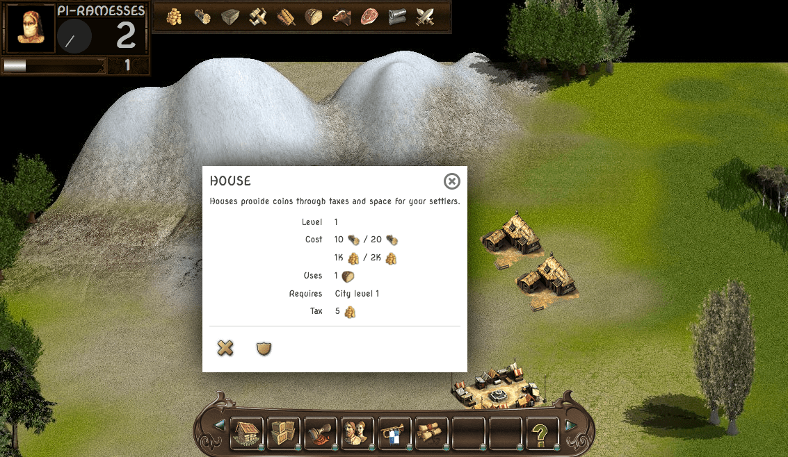

Description
===========

City Builder is a city-building engine/game written in Javascript with the help of the jQuery library.

Features
========

- Over 30 types of buildings, each intertwined in the chain of production.
- Custom climate zone, each with specific buildings.
- Global market, player can trade goods with computer players.
- Armies, ships, wars, treaties.
- Fame system that allows your city to level up via trades, conquers and special buildings.
- Prestige system that affects diplomacy.
- Random events that can change your diplomacy status with the other cities, give you coins or
random resources.

Missing
=======

- (NOT STARTED) Server component, no actual data is saved externally, only in your browser's localStorage.
- (IN PROGRESS) Ranking screen, where cities get ranked according to their status in the world.
- (NOT STARTED) Any player interaction since no data is transmitted to the server component.
- (IN PROGRESS) Declare war, treaties, much of diplomacy.
- And many others. Stay tuned though.

Screenshots
===========

[Intro game](docs/images/intro-game.png)

[Main game area](docs/images/game-started.png)

[Buildings screen](docs/images/buildings-screen.png)

[Storage space](docs/images/storage.png)

License
=======

City Builder is written by sizeof(cat) <sizeofcat AT riseup DOT net> and distributed under the [MIT license](LICENSE).

Contributing
============

Pull requests are always welcome!

I am always thrilled to receive pull requests, and do my best to process them as fast as possible. Not sure if that typo is worth a pull request? Do it! I will probably appreciate it.

If your pull request is not accepted on the first try, don't be discouraged! If there's a problem with the implementation, hopefully you received feedback on what to improve.

Always sign your commits!

Source code
===========

City Builder has ~12137 lines of code, give or take and can be [downloaded from GitHub.com](https://github.com/sizeofcat/city-builder/archive/master.zip) or by using git to clone the repository:

`git clone git@github.com/sizeofcat/city-builder.git`

Dependencies
============

- jQuery 3.1.1
- jQuery UI 1.11.2
- jQuery Tipsy 1.0.0a
- jQuery scrollTo 1.4.14

Thanks
======

The `music/track1.mp3` song is named 'Glandula Pinealis' by Shatifax.